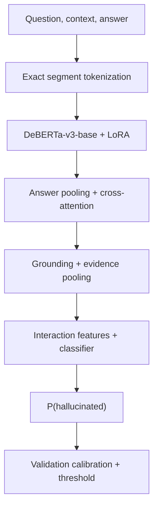

# Architecture

## Runtime flow

1. Load one condition or ablation YAML and merge it with `configs/base.yaml`.
2. Resolve every path from the project root, not the notebook directory.
3. Validate required fields, class balance, expected row counts, hashes, and
   question/context group disjointness.
4. Normalize the three fixed splits without resampling.
5. Build or reuse a content-addressed tokenization cache.
6. Train GAER++ and select the best checkpoint using validation F1.
7. Reload the best checkpoint and fit temperature plus threshold on validation.
8. Evaluate the frozen test set and write aligned predictions.

Each heavy training/evaluation stage runs in a fresh Python process so GPU
memory is released between ablation variants.

## GAER++ computation

The refactor preserves the supplied computation and state-dict names:

The legacy HKG-Fusion implementation remains in `models/legacy_hkg.py` only
for comparison and loading old checkpoints.

## Version 2.1 clarifications

B–F all use a joint question/context/answer encoder. B zeros explicit evidence features but retains context in the encoder input. C adds answer-to-context attention with uniform evidence pooling. D uses learned grounding weights. E adds six statistics to the classifier. F adds difference, product and cosine interactions. The full-width feature layout is preserved across these variants, with disabled features zeroed.

Grounding logits, pooling weights, statistics and evidence accumulation are computed in FP32 before converting pooled evidence back to the encoder dtype. This prevents FP16 epsilon underflow and infinite gradients for single-token/empty answer spans. Frozen evaluation applies the saved validation temperature to raw scalar logits, matching validation calibration without recovering logits from clipped probabilities. Parameter names remain compatible; precision changes can affect predictions and should be recorded when comparing against older runs.
